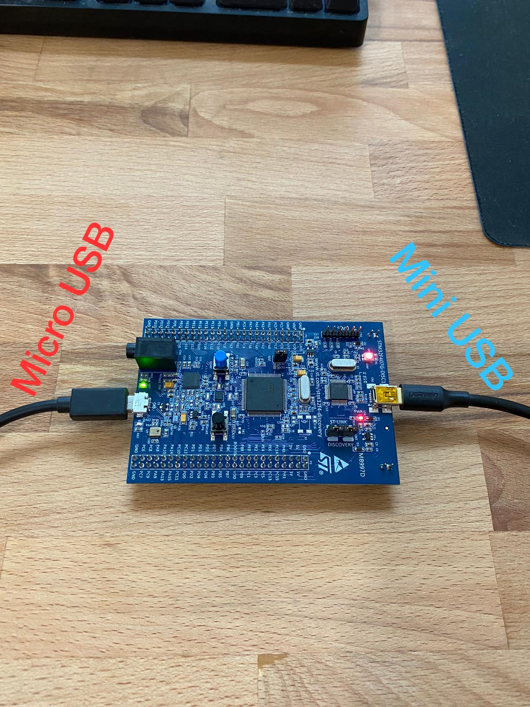
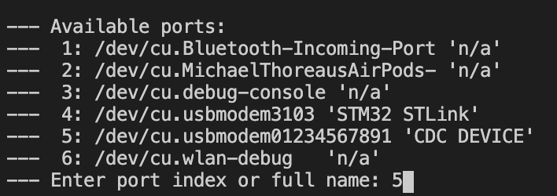

## USBSerial on the stm32f4Discovery Board

The stm32 discovery board has a second USB port which we can use to communicate to a host PC via USBSerial. The second cable required is a micro-USB cable and should be plugged in as shown below:



<br />


---

<br />

### Code Required

We need to create a `USBSerial` object to send strings via the usb port. We can do this directly:

```
#include <USBSerial.h>
USBSerial serial;
serial.printf("test\n\r");
```

or via a pointer:

```
#include <USBSerial.h>

USBSerial* serial;
serial = new USBSerial();
serial->printf("test\n\r");
```


---

<br />

### Usage

The serial port can be accessed via the serial console in VSCode. Click the 'platformIO Serial Monitor' button in the bottom bar and select the appropriate serial port. On Windows, it will be something like 'COM7'. On a mac, it may appear as something like '/dev/cu.usbmodem*'. e.g.




**Note:** The code should be running before attempting to open the serial terminal, otherwise VSCode may open the wrong port. If the port doesn't match the 2nd serial port assosciated with this board.

<br />

---

<br />

## Required drivers

On a Windows host machine, a driver is required to use USBSerial, it can be downloaded here (registration email required): https://www.st.com/en/development-tools/stsw-link009.html

Drivers are not required on Mac OS, including those with ARM based silicon.


